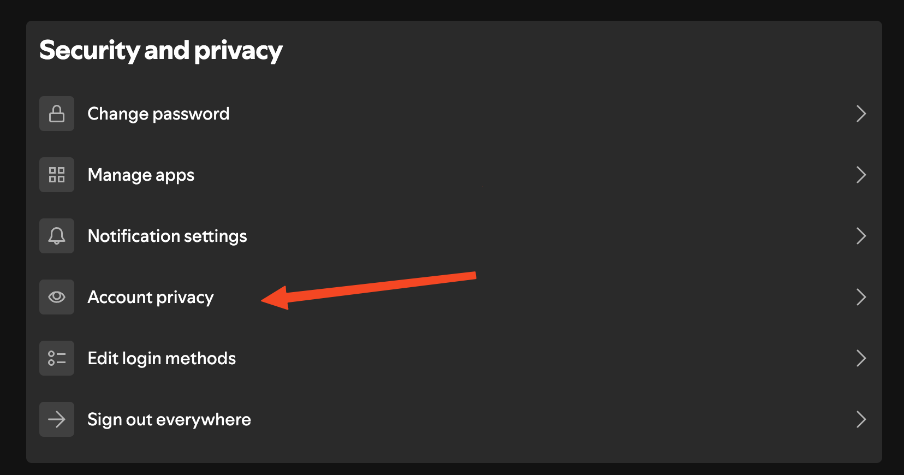
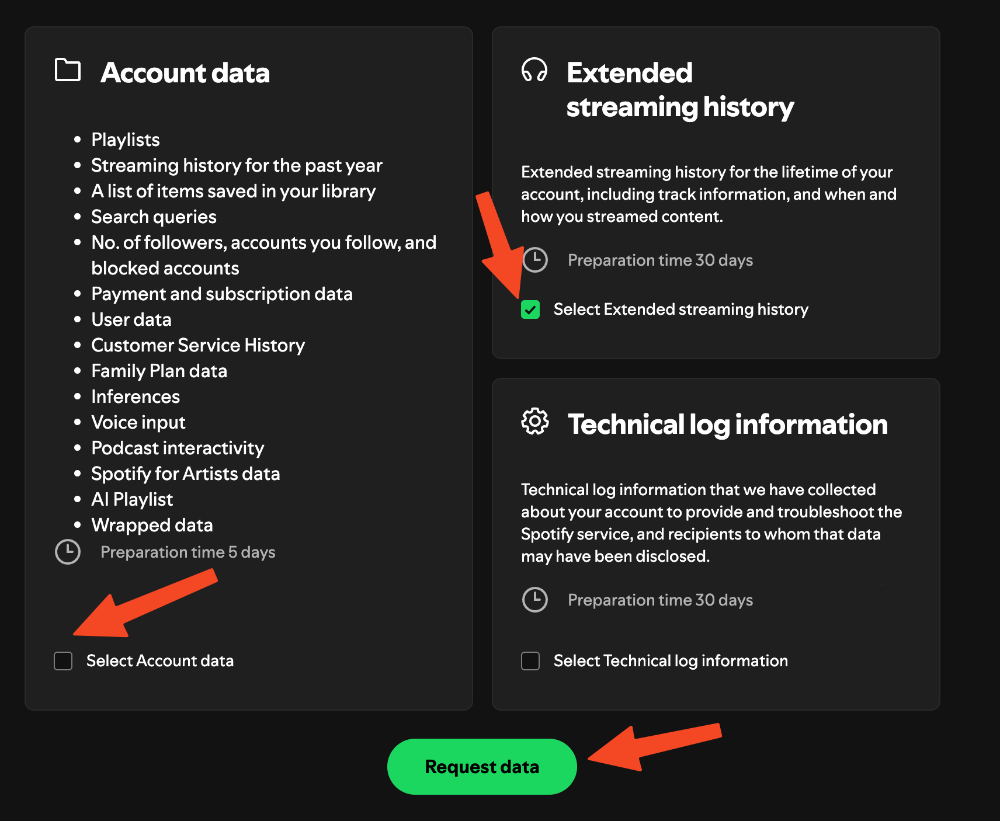

So you want to gain insights into your Spotify listening history? MyStats has you covered! With our powerful API, you can easily retrieve and visualize your Spotify listening history, including top tracks, artists, albums, and more.
This guide will walk you through the process of retrieving your Spotify listening history and how to use it to gain insights into your listening habits.

## What is Listening History?
Listening history is a record of all the tracks you have ever listened to on Spotify. This can be tracks you streamed for 10 seconds or 10 hours on loop. All this data is stored in your Spotify account and has been generated by Spotify. We have no control or affiliation with this data.

## How to export your Spotify listening history

To export your Spotify listening history, you need to follow these steps:
1. **Login to Spotify**: Go to the [Spotify Account](https://open.spotify.com) and log in to your account.
2. **Navigate to the Spotify history page**: Click on your user profile -> Account or [click here](https://www.spotify.com/ca-en/account/overview).
3. **Account Privacy**: Scroll down to the bottom of the page and click on "Account Privacy".
4. **Request Data**: Scroll down to the bottom of the page once more, uncheck `Select Account data` and check `Select Extended streaming history`, then click `Request data`.

It may take up to 30 days for Spotify to process your request and send you an email with a link to download your data. Once you receive the email, click on the link and download the data.
The data will contain information until 2 days before the request was made.

For more information view the images bellow:

